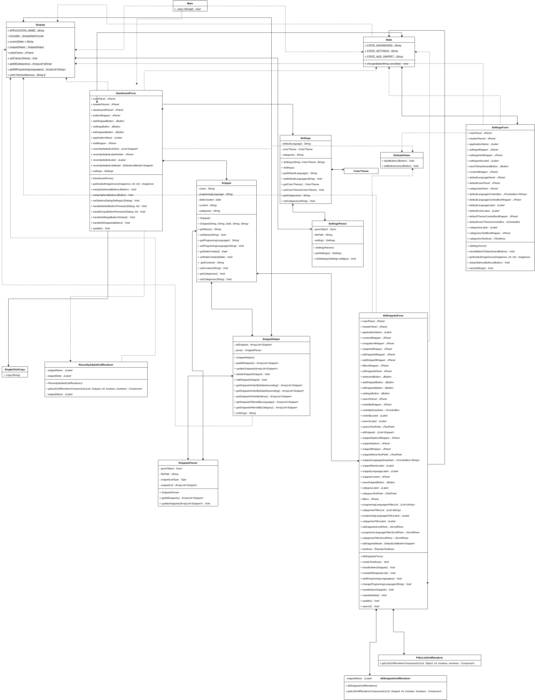
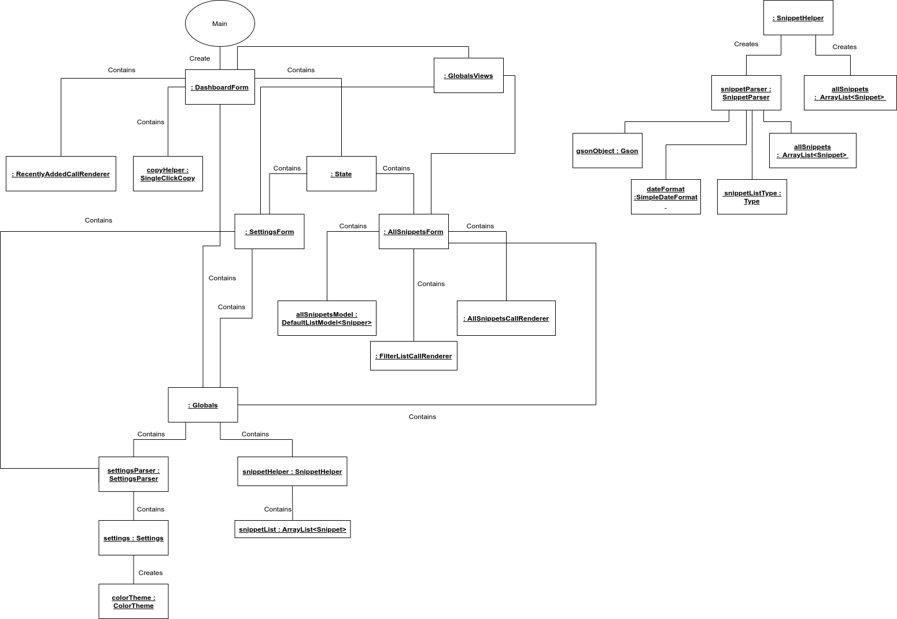
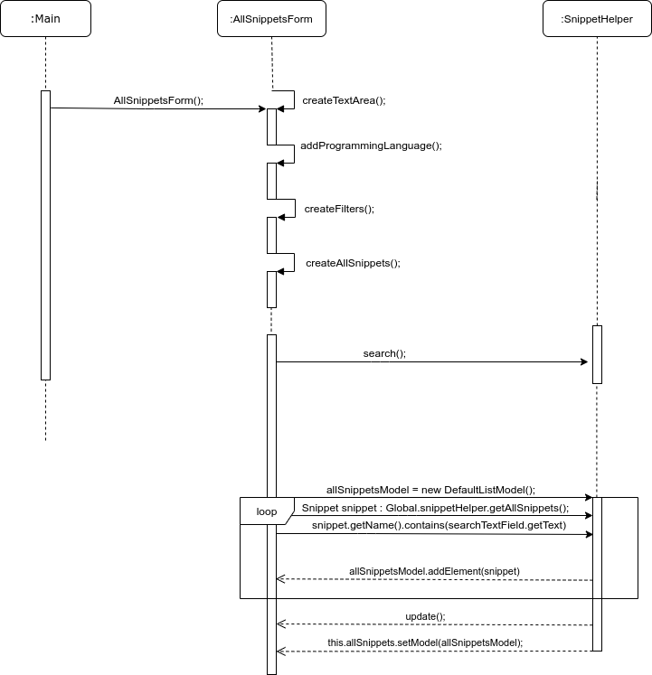
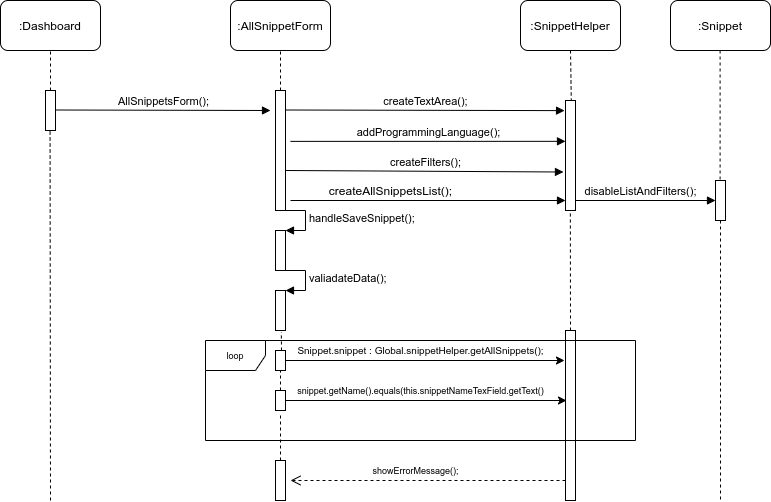

# Assignment 2

### Group 14 - CodeSnippetManager - “Coniunx”
<br>Dimitar Georgiev - dgv500
<br>Klimis Tsakiridis - kts480
<br>Iva Dimitrova - ida460
<br>Stoyan Tsinov - stv500


### Implemented feature

We have already implemented the following features. The implemented features can be seen in the `code` branch in our repository. The way we have implemented the features is explained below by the Class Diagram section. Some of the states and or sequences can be seen in the appropriate sections.

| ID  | Short name  | Description  |
|-----|-------------|--------------|
| F1  | Add snippet  | Provide the user with the option to add snippets. When a snippet is added the option to set categories and programing language will be available.  |
| F2  | Update snippet  | Update an existing snippet |
| F3  | Delete snippet  | Delete an existing snippet |
| F5  | Order snippets |For ease of use, an ordering functionality will be introduced. This will help the user to easily locate the desired snipped faster <br>1.  By name - order the snippets per name <br> 2. By date - order the snippets per date|
| F7  | Syntax highlight | When the user is inserting text in the snippet the text area will highlight the code |
| F8  | Programing language support | The software will provide the following programing languages syntax recognition. Depending on the user choice of the language all reserved commands will be highlighted.|
| F9  | Search snippets | The user will be able to search in the list with snippets. The search will search only in the name of a snippet |
| F10 | Single-click copy | Single click functionality will provide a dedicated button where with a single click you can copy the whole snippet |

In some of the features, we have a known error (not using the appropriate snippet list to update/delete a snippet) which will be solved with the next code iteration.
 
 Here is the list with the features still to be implemented. 

| ID  | Short name  | Description  |
|-----|-------------|--------------|
| F4  | Save as file | Provide the option to download the snippet as a file |
| F6  | Change settings  | This feature will provide the user with the opportunity to:<br>- Change the colors of the system <br>- Add categories<br>- Set default programing language  |
| F11 | Filter sippets | Filtering snippets has the aim to keep the working environment more organized when showing only snippets from desired programing language or category or both:<br>- By programing language - This feature will provide the option of filtering the snippets on programing language <br>- By category - This feature will provide the option of filtering the snippets on category|


### Used modeling tool
As a modeling tool, our group decided first to create the class diagram using the integrated UML tool of Intellij for a base class diagram. This tool helped us to clearly see the connection between the classes we have. At a later stage, we recreated and updated the diagram in `draw.io`. We decided to use `draw.io` since they provide a plug-in for Google Docs where we all can work on the diagrams together.


## Class diagram									
Author(s): `Dimitar Georgiev, Klimis Tsakiridis, Stoyan Tsinov, Iva Dimitrova`

`Figure representing the UML class diagram`


#### Main.java (introduced v1.0 still alive) 

```java
public static void main (String[] args) {

    Globals.currentState = State.STATE_DASHBOARD;
    Globals.setFrame(new DashboardForm().mainPanel);
}
```
Since we are sure every time the user starts the application he/she will end in the Dashboard screen we set the current state of the application to be the `DASHBOARD_STATE`. After we complete this we call the `setFrame()` method in the `Globals.java` class which will take as parameter a `JPanel` and change the screen of the application depending on the `JPanel` we passed as parameter.


#### ColorTheme.java (introduced v1.1 still alive)

This class is used to set the color theme of the application. When the application is started an instance from this class is created which is parsed from the settings.json. This instance is available all the time since we need to see the colors for all components and we cannot be sure at what time the user will request a different component. The class has an empty constructor that will take the default/last set color theme. When the user changes the settings for the color theme the new color theme will be dynamically injected in the instance and change the whole look and feel. We are aware that there are plenty of data fields present in this class but we wanted to make sure that when using a color we use the correct color instead of wondering which color goes where, hence we have fields such as: `snippetScreenSaveButtonHoverBackgroundColor`, `dashboardButtonHoverBackgroundColor` which will explicitly say for which element we use the given color. 

#### Settings.java (introduced v1.0 still alive) 

This class will hold/create the settings. The various settings will be held in this class. The class contains information about the settings for the system such as: defaultProgramingLanguage, categories and colorTheme. The class is instantiated only once in the `Globlas.java` class from where the settings are read in the system. When we parse the settigns.json file an object is created from this type. When the user changes a setting in the application the current settings object is updated and translated back to `JSON` and saved as such.


#### SingleClickCopy.java (introduced v1.0 still alive) 

The class contains s single method `copy(Snippet snippet)` that will copy the content of the snippet passed as a parameter. The content of the snippet will be set in the “copy buffer” of the system. So basically this copy method will perform `ctrl + c` for us so the user can paste it anywhere he/she wants. We are aware that having a class for one functionality is a bit of an overkill but we also consider that maybe by the end of the project we will have to add some extra methods in order to make it flexible.

***NB:** In case we keep it as it is and do not add extra functionality to it we will move it to the SnippetHelper.java class, where we keep all of the snippet manipulations.*

#### Snippet.java (introduced v1.0 still alive) 

The snippet class is the class that is used to create snippets. All if its variables are private. The snippet class is used when we parse the snippets.json file. The parser will create an ArrayList of snippets that we will use through the system. The data fields of this class are:
```
name
programingLanguage
dateCreated
content
categories
dateModified
```

All of its data fields are private. In order to get/set any property of a snippet, we use the provided getters and setters. Up until this point, we think that this information about the snippets is enough. If by any chance we need an extra field, we can easily add it and use it trough the system.


#### SnippetHelper.java (introduced v1.0 still alive) 

The Snippet helper class is the class that manipulates the snippets. It instantiates the SnippetParser.java class which provides the data and is using this data according to our needs. We are using only one object (ArryList<Snippet>)containing all snippets and we used it to complete the needed manipulations. Here are the methods used in this class:

`public SnippetHelper()`\
A constructor without any arguments that creates an instance of the SnippetParser class and reads all of the snippets from it.

`public ArrayList<Snippet> getAllSnippets()`\
Returns a list with all of the snippets fetched form the parser. 

`public void updateSnippets(ArrayList<Snippet> updatedSnipptes)`\
This method will take the updatedSnippets list and parse it back to JSON format using the SnippetParser class. Depending on the list we pass this information will be stored in the snippets.json file.

`public void deleteSnippet(Snippet snippetToBeRemoved)`\
Deletes a certain snippet from the list and updating the snippet.json file

`public void editSnippet(Snippet snippetToBeEdited)`\
Updates a snippet with the newly entered information.

`public ArrayList<Snippet> getSnippetsOrderByDateAscending()`\
Returns a list with ordered snippets by dateCreated ascending order.

`public ArrayList<Snippet> getSnippetsOrderByDateDescending()`\
Returns a list with ordered snippets by dateCreated desscending order.

`public ArrayList<Snippet> getSnippetsOrderByName()`\
Retruns a list with ordered snippets by name.

`public ArrayList<Snippet> getSnippetsFilteredByLanguage(String filterLanguage)`\
Returns a list containing snippets only from a certain programing language.

`public ArrayList<Snippet> getSnippetsFilteredByCategory(ArrayList<String> categories)`\
Returns a list containing snippets only from a certain category.

`public String toString(Snippet snippet)`\
Custom to string method, mainly for testing purposes to see if the data is passed correctly.


#### State.java (introduced v1.0 still alive) 
The sate class is controlling what the current view will be. We have four main states:
```java
public static final String STATE_DASHBOARD      = "STATE_DASHBOARD";
public static final String STATE_SETTINGS       = "STATE_SETTINGS";
public static final String STATE_ADD_SNIPPET    = "STATE_ADD_SNIPPET";
public static final String STATE_ALL_SNIPPETS    = "STATE_ALL_SNIPPETS";
```

These static variables will determine the state of the application and populate the screen accordingly.

`public void changeState(String newState)`\
This method will be used every time we change the state (switch a screen). This method will set the current state depending on what we pass as a parameter and will show the appropriate screen depending on this parameter. For example:
The user is on the AllSnippets screen, the current state is  `STATE_ALL_SNIPPETS`, that means that on the screen now we will see all snippets. The user clicks the navigation and he/she goes to Dashboard. When this click occurs we will trigger an event that will change the state to  `STATE_DASHBOARD` and call this method with parameter `STATE_DASHBOARD` which will change the screen to Dashboard.

Doing so we can easily control the screens and changing a screen will not be so difficult.

#### SnippetParser.java (introduced v1.0 still alive) 
The snippet parser is the class that will read the snippets.json file and turn the JSON string into Snippet objects and vice versa. The class contains a constructor and two methods:
```java
public SnippetsParser() {
    this.gsonObject = new GsonBuilder().setDateFormat("dd/MM/yyyy").create();
    this.filePath = "src/main/java/JSONFiles/snippets.json";
    this.snippetListType = new TypeToken<ArrayList<Snippet>>(){}.getType();
    this.snippetList = new ArrayList<>();
}
```
Here we set the date format we use for the snippets, the path to the `snippets.json` file, the type we will use when we read the `Snippet` objects to `JSON` and we initialize the snippetsList.

`public ArrayList<Snippet> getAllSnippets()`\
In this method, we read the JSON file and we create a list with `Snippets` objects from it. This is the only instance of this list that we use all the time. Doing so we make sure that we read the file only once since there is a possibility that this file becomes too big.

`public void updateSnippets(ArrayList<Snippet> updatedSnippets)`\
This method updates/overrides the current file we have depending on the list that we pass. We use the `Type` created in the constructor to point out to the `Gson` library that we want to deserialize the object in a certain format. The method is called every time the user changes/adds/deletes a snippet to reduce the data loss in case of a crash.

#### SettingsParser.java (introduced v1.1 still alive) 
The settings parser have the same functionality as the snippet parser but it is parsing the `settings.json` file. The interesting part of the class comes where we parse the `Color` class that is used for setting the color theme. Since we use a library to serialize and deserialize the JSON file this process is handled automatically. The output for the color theme is a bit different than expected but it is working so we are not planning change our approach to it. The downside of this is that the data stored in the settings.json file is not fully readable for a human (only the color theme). Here is a small example:
```json
"colorTheme": {
  "backgroundColor": {
    "value": -991003,
    "falpha": 0.0
  },
  "headerBackgroundColor": {
    "value": -12049618,
    "falpha": 0.0
  },
  "headerTextColor": {
    "value": -1846312,
    "falpha": 0.0
  },
  "headerButtonBackgroundColor": {
    "value": -12049618,
    "falpha": 0.0
  },
  .
  .
  .
}
```
Strangely enough when we read the `JSON` all of the color are translated properly. 


#### Colors.java (introduced v1.0 NOT USED ANYMORE) 
The class was used to suit the need of taking static colors from it, but since we decided to have different color themes as set color palettes it becomes useless. We will still keep it since maybe a custom color can be introduced. Moreover, another possibility of using the class is to make it as a factory for the color themes. This will reduce the length of the `ColorTheme` class and also will make it easier to create new color themes.


#### Globals.java (introduced v1.0 still alive) 
A class consisting only from static methods and variable. This class is crucial for the application. Since in lots of places we use the same code this class will hold this code for us so we can reuse it at anytime. 
```java
public static final String APPLICATION_NAME = "Coniunx";
public static SimpleDateFormat formatter = new SimpleDateFormat("dd/MM/yyyy");
public static String currentState = "";
public static SnippetHelper snippetHelper = new SnippetHelper();
public static SettingsParser settingsParser = new SettingsParser();
public static JFrame mainFrame = new JFrame(Globals.APPLICATION_NAME);
```

Static variables help us getting the currentState of the application as well as the name of the application. Here we also have an instance of the snippetHelper that will provide the snippet manipulations as well as the `settingParser` that will provide the settings. During the usage of the application, these variables will change and we do not need to worry about is since they are static and every time we need them, we will get their current situation.

`public static void setFrame(JPanel panel)`\
Used to set the frame depending on the current state of the application.

`public static ArrayList<String> getAllCategories()`\
We use it in a couple of places. This reduces the code length.

`public static ArrayList<String> getAllProgramingLanguages()`\
Used to get all of the supported programing language.

`public static String[] colorThemesNames = {"Light","Dark","Moonlight"};`\
Used to populate the drop-down list in the Settings screen. Depending on the choice we will change the theme accordingly.

When we notice a repetitive code we put it here as a static variable/function for ease of use and access. More methods and/or variables can be moved here.

#### GlobalsViews.java (introduced v1.1 still alive) 
All the button styling that we used will be created here. Setting colors, icons, and text. This class will hold all the repetitive code for the visual parts of the application. Currently, most of the methods are in the From classes themselves but we will refactor it and make sure that the repetitive methods will be here. 

The only case where we have to set the listeners of the button we consider to keep it in the Form classes itself since this will give us more flexibility to make the button perform not general.

#### AllSnippetCellRenderer.java (introduced v1.0 still alive) 
The class constructs a single list view that will be populated in the list. Especially this case  the class is setting the list to contain the name of the snippet plus the extension of the file, which basically will be the filename.

#### FilterListCellRenderer.java (introduced v1.0 still alive) 
The class constructs a single list view that will be populated in the list. Especially this case the class is making a list of checkboxes with the categories or programing language filter. The class is used in both cases. Setting some click listeners will allow us to select multiple items and read back which items are selected. Using these items as parameters in the SnippetHelper class we can filter the snippet list.

#### RecentlyAddedCellRenderer.java (introduced v1.0 still alive) 
The class constructs a single list view that will be populated in the list. Especially this case the class is setting the item to have two text fields, one with the name and the second with the date created. Setting a double click listener to the item we get the option to edit/delete/copy the selected snippet.

The whole application UI will be created using Swing Forms. We will have one main Swing Frame that can be repainted with different Forms. Every application state will have its own form. The following classes will explain how the components in these Forms will be handled in the different states.


#### AllSnippetsForm.java (introduced v1.1 still alive) 
This class will paint the all snippets screen. We will have a text area that will handle the content insertion/edition, a filter panel that will contain all the filters and snippets list that will contain the current existing snippets. Furthermore, we will have a dedicated button to add a snippet that basically will empty the text area and provide the possibility to the user to insert new information about the snippet. All of the different parts mentioned will be placed in wrapper panels for ease of placement on the screen. Navigation will be provided on the left-hand side for ease of access to all of the other screens. Using the Globals.java we can access all of the needed information with a combination of the SnippetHelper we can manipulate the snippets. A search box is present here which has an onKeyUp listener that will change the data model dynamically in order to see the results immediately in the snippets list located on the same screen. The filters will have the same functionality using again the SnippetHelper class.

`private void createTextArea()`\
Creates a text-area that has a syntax highlighter.

`private void handleSelectSnippet()`\
Updates the visual content part with the selected snippet data.

`private void createAllSnippetsList()`\
Populates the snippets list with the correct list render.

`private void addProgramingLanguages()`\
Populate the programing languages drop-down menu

`public void createFilters()`\
Creates the filters checkboxes

`private void changeProgramingLanguage(String programingLanguage)`\
When a user chooses a snippet from the menu we are changing the selected programing language accordingly.

`private void handleSaveSnippet()`\
If it is a new snippet, we add the new snippet. If it is existing, we update it.

`private void validateData()`\
Validate the data: if the name is empty or already exists, or if the content is empty, give a warning message.

`private void update()`\
This method will update the snippets list view

`private void search()`\
The search method will change the data model of the snippets list


#### DashboardForm.java (introduced v1.0 still alive) 
This class will paint the all dashboard screen. This will be the initial state of the application. In this screen, we will have a list of the recently added snippets that will instantiate the AllSnippetsListRenderer in order to populate the list. Moreover, we will have the options to Add Snippet, see All Snippets and change Settings. These options will be provided with separate buttons in order to be able to change the state of the application so we can repaint the other screens. 

`private ImageIcon getScaledImageIcons(ImageIcon imageIcon, int width, int height)`\
Get button icons

`private void setupDashboadButton(JButton dashboardButton)`\
Setting the dashboard button

`private void setupOptionsButton(JButton optionButton)`\
When double click a button a list item, a dialog box will pop up with three buttons. We use this to set their look and feel.

`private void setOptionsDialogSettings(JDialog optionsDialog)`\
Creating the dialog box with the options per item such as edit/delete/copy

`private void handleDeleteButtonPressed(JDialog optionsDialog, int index)`\
Called when delete button is clicked. It will delete the selected snippet.

`private void handleCopyButtonPressed(JDialog optionsDialog, int index)`\
Called copy the button is clicked. It will copy the content of the snippet.

`private void handleSettingsButtonClicked()`\
Called when the settings button is clicked. It will go to the settings screen.

`private void handleAllSnippetsButton() `\
Called when the all snippets button is clicked. It will go to the all snippets screen.

`private void update()`\
Used to update the Recently added list when an item is deleted.


#### SttingsForm.java (introduced v1.0 still alive) 
This class will paint the settings screen. In this screen, the user can choose the color theme and the default programing language. What is more, he/she can add the categories here as well in a comma-separated list. When pressing the save button the settings will be applied automatically and also will be parsed back to the settigns.json file. This will play the role of “saving” your settings for next time or until they change again.


`private ImageIcon getScaledImageIcons(ImageIcon imageIcon, int width, int height)`\
Get button icons

`private void setupOptionsButton(JButton optionButton)`\
Setting the navigation button

`private void saveSettings()`\
Reads the user settings from the Settings Screen components and updates the current settings.

`private void update()`\
Applies the settings.


## Object diagrams								
Author(s): `Dimitar Georgiev, Klimis Tsakiridis, Stoyan Tsinov, Iva Dimitrova`

`Figure representing the Object Diagram`

  
Above you can find our object diagram. In some cases such as in the `State` class, we have an instance of a class but we do not keep it in object since we are using only one field/method of it. Eg: 

```java
Globals.mainFrame.getContentPane().add(new DashboardForm().mainPanel);
```
Here we are just using the main panel in order to repaint the current main from the panel. Since the `mainPanel` is public and we can access it like that we decided that storing it in the memory is a bit of overkill. 


Furthermore, in the following paragraphs we will explain the logic behind why do we create and how do we use the created objects.

The main method is using the `State` class in order to change the view and show the Dashboard screen. As discussed in Assignment 1 this will be our starting point. The `State` class is using the `changeState` method to display the freshly created Dashboard panel.

The Dashboard screen contains a JList that will be populated with the `RecentlyAddedCellRenderer`. This object will draw the item per list row. When we double click we will get the option to edit/delete/copy a snippet. Both edit and copy functions are part of the `SnippetHelper` class which is instantiated only once in the `Globals` as static so we can use it any time we need to perform manipulations of the snippets. Since we have the copy to clipboard feature moved to a different class, we also create an object from it in order to use the copy method.

The `State` class is referenced by all of the views classes since any of the classes can navigate through the application. When changing the state this class also sets the `currentState` object in `Globals` which is used to determine where are we at any point in the application process.
 
The `Globals` class contain all object and methods that are used more than once but need to be initialized only once in order to prevent any confusions of the system. It contains objects from type: SnippetParser, SnippetHelper, SimpleDateFormat and JFrame. All of the mentioned objects are accessed more than once, thus the access is `static`.

The `SnippetHelper` class contains a `SnippetParser` which will provide all of the snippets. The `SnippetParser` is initialized only once in order to make sure that we have only one instance of the snippets list. The helper contains a single instance of an `ArrayList<Snippet>`. This list is used in order to complete the desired snippet manipulations. When manipulation is requested this list will be the base for it, Depending on the manipulation a new updated list will be returned as a result. The new list will be used from the GUI to display the result from the search for example. The only exception is when we add/delete/edit snippets which we will use the object selected from the new list and add/edit/delete from the original list fetched from the parser. Doing so we will synchronize both lists to contain up to date objects as well as keep the `snippets.json` file up to date, since to reduce the chance of data loss we will update the file on every add/edit/delete request.

The `SettingsForm` contains an instance if the settings that are located in the `Globals`. When the user changes the settings we will use this reference and access the `SettingsParser` in order to update the new settings.

The `AllSnippetsForm` class contains `DefaultListModel` from type `Snippet` that will provide the data for the `AllSnippetCellRenderer` to create the all snippets list. The snippets will be taken from the `Globals.snippetHelper.getAllSnippets()` and will be populated in the `JList`. Moreover, The filters used have a custom made cell render as well in order for the items to selectable more than one at the time without refreshing the whole JList. The list is using an instance of `AllSnippetsCallRenderer` to accomplish this. 

The `SnippetParser` will use the Gson object that is part of the Gson library and serialize or deserialize the snippets. The `gsonObject` uses the `dateFormat` object that will set the date format to the date when the snippet is formatted. Since we are sure the `snippets.json` file will contain a list with snippets we have to make sure that we note that to the Gson object in order to be able to parse the data properly. This is done by extracting the class type from the list using the `snippetListType` object.  

The `SettingsParser` has the same logic as the `SnippetParser` with the difference that we do not use the type object since the settings can be only one. The data is handled with the same Gson library.

## State machine diagrams									
Author(s): `Dimitar Georgiev, Klimis Tsakiridis, Stoyan Tsinov, Iva Dimitrova`


#### Description of ‘Add Snippet’ state

To enter any state in our program the user first needs to open the application. This will take him to the Dashboard screen which is populated with various elements. 

In the Dashboard, there is an option called ‘Add Snippet’. When the user presses it, the interface changes and the program enters a different state. 

First, we will describe what the interface looks like in this state. On the left side of the screen, there is an empty searching bar, where the user can input the name of the snippet he is searching for. Underneath this bar, there are two filter areas with click boxes. In the first table, the user has the option to use a programming language filter. Various commonly used programming languages are previewed here such as C++, Java, Python, etc. Using this filter the user ensures that the corresponding results will be snippets written with one of these language formats. 

The second table enables the user to filter his search by category. This feature is a bit vaguer. Upon creation of a snippet, the user is able to indicate what type of category his snippet is. Some examples could be formal, custom, tutorial, etc. This is another way of making the user’s search more efficient and hassle-free. 

These two cover the left part of the screen. On their right side, there is a table that lists the existing snippets. Using the searching bar changes the look of this table. Whenever the user clicks on a snippet, its content is expanded in the text editor.

The text editor covers more than half of the screen and is positioned on the right side of the screen. This is where the user can create new snippets, preview the contents of a selected snippet or edit an existing one. The text editor table has three empty bars at its top. These need to be filled in order for a new snippet to be created. The details the user has to fill are name, programming language, and category. Underneath these bars, there is an empty text editor field where the user can write his code. Our text editor also has text recognition responding to the chosen language. At the bottom of the text editor there is a wide ‘save’ button that saves the changes in the snippet; be it the creation of a new snippet or the editing of an already existing one.

To enter the ‘Add snippet’ state the user has to press on the corresponding button from the Dashboard. That will take him to the interface described above. All the snippets will be previewed in the snippet list and all the filters will be disabled. The text editing area will be blank and there will be two buttons at its bottom: 'cancel' and 'save'.

For the creation of a new snippet, the details described above need to be filled. However, out of the three labels, only the name is mandatory at this point. Programming language, as well as category, can be left blank. If a certain programming language is not chosen then the program will be default select ‘TEXT’. After this step, the user enters the blank text editing area to implement his snippet. There needs to be something written here as well. This area cannot be left blank, as the program will check for it before saving the snippet and the process will not be completed. 

'Cancel' is one of the two buttons on the bottom of the text editor. When it is pressed, both filter tables are activated. In addition to that, the snippets list is also activated. While writing in the text editor, these two features are deactivated and cannot be accessed. So, cancel removes all the previous work done; the name is removed and the name field is blank, programming language field resets and returns to ‘TEXT’ and the category, as well as the text editing area, are also cleared. It is important to note that the application does not crash when cancel is pressed. It keeps working as normal, certain features are just unlocked. 

The other button is ‘Save’. When clicking ‘Save’ the program initiates checking if the details needed are correctly filled. This means that it ensures that a name for the snippet exists as well as the content is not empty. Then a new snippet is created. This snippet carries the data that were filled in the previous procedure. After that, the public class Globals is invoked. This is done in order to access the SnippetHelper. Through the SnippetHelper the program accesses the SnippetParser. The SnippetParser is used to add the new snippet in the list, as well as to pass the updated list to the update function.  The update function then converts the snippet objects to a JSON format and saves the JSON converted snippet in the file.


#### Description of Edit Snippets’ state:

The second state we are going to describe is ‘Edit Snippets’. 

The first thing a user has to do is, again, is open the application. Doing so is getting him to the Dashboard state. Next, the user has to choose Add Snippet. This will enable the ‘All Snippets’ screen. Through the ‘All Snippets’ state, the user can perform a series of activities such as sorting, searching, editing, adding or deleting a snippet. On that screen, there are lists of filters as well as a list of Snippets. The text editor, which is on the left of the screen will be automatically filled with the chosen snippet. If the user chooses another snippet then its content, as well as details (name, programing language), will be filled in the corresponding blank spaces on top of the text editor. Finally, at the bottom of the editor, there is the ‘Save’ button. Any changes made, followed by a click on the save button will automatically update the current snippet. 

When editing a snippet certain steps need to be followed in order for the process to be successfully completed.

Firstly, the name needs to be edited. This does not necessarily mean that the name needs to be changed. It means that the user has to make sure that a name for the snippet exists. Otherwise, the process cannot be completed. 

The next data field is the programming language. As in the ‘Add snippets’ state, this field can be left blank, in which case it will automatically be filled with the option ‘TEXT’, or not changed and hence inherit the previous programming language preference stated in that snippet. 

In addition to programming language, the category field can also be left unchanged. Again, the previous data will be preserved, if there was any.

Finally, there is the content of the snippet. This is another mandatory field, that needs not to be empty. So the user can either write new text down, edit some of the existing, or entirely change the content of the snippet. 

When the user is done editing the snippet, the next thing he needs to do in order to complete the process is saving his changes. Pressing save will cause the program to go through several steps. Validation of the data is the first step. That means that a check will be performed in order to ensure that a name does exist for the snippet and the content is not empty. Then the selected snippet object is taken from the Datamodel of the JList and is passed as a parameter inside Globals’ SnippetHelper. SnippetHelper can perform various tasks through its functions such as add, search, delete edit or sort snippets. Sorting can be done by name (ascending or descending), date (ascending or descending), as well as date modified (ascending or descending). 

In this state, though, we care about the editing method. So, through snippetHelper, the program moves to the updateSnippet method. The program uses this method to update the passed object in the allSnippetsList and send it back to the SnippetParser. In the SnippetParser the now updated list is used in the update function. There a conversion takes place that translates the snippet object to JSON format. After this is done, the new JSON-format outcome is saved in a file. Finally, in order to see the changes, the data needs to be updated. So, the program updates the data model in the All Snippet Screen and the updated snippet becomes visible. 


## Sequence diagrams									
Author(s): `Dimitar Georgiev, Klimis Tsakiridis, Stoyan Tsinov, Iva Dimitrova`

Sequence diagrams are all about capturing the order of interactions between parts of your system. Using a sequence diagram, you can describe which interactions will be triggered when a particular use case is executed and in what order those interactions will occur. Sequence diagrams show plenty of other information about interaction, but their flow is a simple and effective way in which they communicate the order of events within an interaction. They illustrate how the different parts of the system communicate with each other when a certain action should be executed and the order of the sub-action that needs to be done in between.
 
In our application, from the main dashboard, there are 3 types of main interactions could be done.
 
#### First main action:
The first one is “Add Snippet”. Although it has not been developed yet it will have the following sub-action:  Since we are using JSON format, for the adding of a snippet we would need some information that the file should contain. To create the snippet, there are five in total sub-actions:
##### First sub-action: Entering the name of the snippet.
This sub action is one of the necessary ones that the user should do in order to create a new snippet.
##### Second sub-action: Select programming language.
There is a given option to choose a programming language. This one could be done by the system itself after the file is saved so, therefore, not a necessary action. Every snippet has a property called “programming language: String”. If the input from the user is empty, hence not filled with the language of the text that the person wants to save as a snippet, the program goes through the function changeProgramingLanguage that would check the syntax of the input and add the name of the programming language in the properties of the snippet.
##### Third sub-action: Insert category.
Another useful feature that our system provides is performing the sub action “Category”. This one is not essential for the creation of a snippet file. By adding category to the file, later on, the user could sort his/her snippets by the category used for the files.
##### Fourth sub-action: Add content.
In the box given for this purpose, the user should enter the text that would be later on saved as the actual snippet that the user wants.
##### Fifth sub-action: Save snippet.
The final sub action is the actual saving of the snippet. After all the information is gathered from the user, the program first appends the snippet to the snippet list. Then sends a list containing the properties to a data parser that parses the given list to JSON format and save it as a file.
#### Second main action:
The second one is “Snippets”. This action changes the page to a new one. From that newly shown interface, there are five sub-actions that could be performed.
##### First sub-action “View all snippets”.
This property is enabled from the opening of the page – on the middle left side all the snippets of the user are shown in no specific order.
##### Second sub-action: Order snippets.
In order to make the search of a certain snippet easier and more efficient, another sub action could be performed on this same page – showing the snippets in some convenient for the user order. There is a choice of two properties that would be used as a sorting tool – the name of the snippet or the date that the snippet has been created on.
##### Third sub-action: Search snippets.
For convenience, the user can perform another sub action on the same page that could ease the search of a snippet from the list – searching through the snippets. This search could be done by entering the name of the snippet. As the user is typing the name, the bar with the files gets updated, as it gets smaller the more specific the typing is to the name. The user is sending a synchronous message to the file waiting for a response containing the suggestion name (if the user didn’t type the full one yet) which after clicking on it again sends a synchronous message to the system, this time getting the full content of the snippet file.
##### Fourth sub-action: Edit snippets.
After performing the previous actions, or at least those who lead to choosing a snippet file, on the same interface the user can also make some changes to the file, for example changing the programming language, editing the category, modifying the content of the snippet. After all that, a sub-action of this sub-action can be done - saving the snippet. It follows the same functionality as the “Save snippet” action from the first main action.
##### Fifth sub-action: Filter snippets.
Another additional sub action is filtering the snippets – therefore displaying snippets according to a given filter. One could be depending on the preference of a programming language; another could be showing only snippets from a certain chosen category.
#### Third main action:
The third main action is “Settings”.
The third action allows the user to make some changes to the overall look and some behavior of the program.
#### First sub-action: Set default programming language.
The first sub action is choosing a default language. This would be helpful if the user needs only snippets from a certain chosen language.
#### Second sub-action:  Set colour theme.
This sub-action can change the colour of the background of the program’s interface for every page. The user has the possibility to choose a colour from a premade from the developer's range of colours.
#### Third sub-action: Add categories.
For this sub-action, the program takes as an input the words or phrases that the user writes in the box separated by commas which creates a new category by taking each phrase or word.
Sub actions available from the dashboard.
As well as performing actions, at the dashboard, we can do 3 sub-actions. On the screen, the latest edited or added snippets are also shown. By double-clicking on each of them a little menu is shown. Three types of sub action are available: 
 
First sub-action from the main dashboard: **EDIT**\
This sub-action leads to a main action by changing the screen, leading to a page allowing the user to make changes to the chosen snippet. It plays roles as a shortcut to the edit page.\
Second sub action from the main dashboard: **COPY**\
This sub-action takes the content of the snippet and copies it. \
Third sub-action from the main dashboard: **DELETE**\

With this sub-action, the user can remove a snippet from his list.
Even though it has not been developed yet, a future prospect would be to add a menu that would allow the user to do (almost) every action from any page. 
 
To explore in-depth the processes in the application, we’ve created two sequence diagrams showing the actions and the sub-actions that happen within every process. For example, if a user is looking for a snippet with a certain name but there is no existing snippet in the system with such a name. 

`Figure representing the Sequence Diagram 1`


The system goes into that sequence of actions. Since there is no condition under which a specific action would be taken if the user is looking for a non-existing file, the bar that shows the search results remains empty.


With the start of the program, the `Main` goes to `Dashboard` which can handle the state of when the button `AllSnippetsForm` is pressed. The class when redirected, executes its methods createTextArea, addProgramingLanguages, createFilters and createAllSnippetsList and starts listening to events. 


The search for snippets is dynamic. It is implemented in the class SnippetHelper. The user starts writing the name of the snippet he wants to find and the program responds with all the snippets that correspond to what is currently written. This happens because of a loop, which on each cycle does the following: Firstly it gets all the snippets from the JSON file. Then it chooses only the ones that contain the current text in the searchTextField. Finally, it displays them in the `allSnippetsModel`. 
When there is no snippet corresponding to the text written by the user, the allSnippetsModels will be empty.
 
The second situation we would be looking into is a case where the user wants to create a snippet but the name picked for this snippet is also used for a file that is amongst the ones that are already created. 

`Figure representing the Sequence Diagram 1`


From the dashboard, the first main action is going to AllSnippetsForm class. From there, it goes to functions about creating the outlook of the page such as createTextArea, addProgrammingLanguage, createFiles, createAllSnippets. The difference with opening the page for viewing and editing snippets is that in this case the options to make changes on the snippets and using filters and lists are enabled. The AllSnippetForm then does a self-call for gathering all the data needed for creating a new snippet. Then again makes a self-call validating the needed data. In order to do that, a loop has been created checking if the data is suitable for saving the data in the `JSON` format that we are using, as well as checking if the information entered is overlapping with the one we already have. The piece of information we are interested in in this situation is the name since the scenario is where the user wants to add a snippet with an already existing name. Then it goes only through the first checking in the loop – checking if the desired for the file name is one that has already been entered in the system. It goes to another class – `SnippetHelper`, that is responsible, in overall terms, for handling already existing information about the snippets. It goes through that part, checking if the name overlaps and in this case gives back an error message, not allowing the user to proceed with his action and asking for a different name.

## Implementation									
Author(s): `Dimitar Georgiev, Klimis Tsakiridis, Stoyan Tsinov, Iva Dimitrova`

After we finished all of the UML designs we reproduced teh same classes and objects in the system. After some rethinking we decided to split the classes in different `Packages` which will make the code more logical and more readable. Here you can find the structure for our `Packages`:

./main\
|----	./assets\
|----	|----	./textAreaThemes\
|----	|----	|----	dark.xml\
|----	|----	|----	default.xml\
|----	|----	|----	eclipse.xml\
|----	|----	|----	idea.xml\
|----	|----	|----	theme.dtd\
|----	|----	|----	vs.xml\
|----	|----	|add_button.png\
|----	|----	|add_snippet_icon.png\
|----	|----	|copy_icon.png\
|----	|----	|delete_icon.png\
|----	|----	|edit_icon.png\
|----	|----	|menu_icon.png\
|----	|----	|save_icon.png\
|----	|----	|settings_icon.png\
|----	|----	|snippets_icon.png\
|----	./java\
|----	|----	./classes\
|----	|----	|----	ColorTheme.java\
|----	|----	|----	Settings.java\
|----	|----	|----	SingleClickCopy.java\
|----	|----	|----	Snippet.java\
|----	|----	|----	SnippetHelper.java\
|----	|----	|----	State.java\
|----	|----	./dataParsing\
|----	|----	|----	SettingsParser.java\
|----	|----	|----	SnippetsParser.java\
|----	|----	./globals\
|----	|----	|----	Colors.java\
|----	|----	|----	Globals.java \
|----	|----	|----	GlobalsViews.java\
|----	|----	./JSONFiles\
|----	|----	|----	snippets.json\
|----	|----	|----	settings.json\
|----	|----	./views\
|----	|----	|----	./listCellRenderers\
|----	|----	|----	|----	AllSnippetsCellRenderer.java\
|----	|----	|----	|----	FilterListCellRenderer.java\
|----	|----	|----	|----	RecentlyAddedCellRenderer.java\
|----	|----	|----	./AllSnippetsForm\
|----	|----	|----	|----	AllSnippetsForm.java\
|----	|----	|----	|----	AllSnippetsForm.form\
|----	|----	|----	./DashboardForm\
|----	|----	|----	|----	DashboardForm.java\
|----	|----	|----	|----	DashboardForm.form\
|----	|----	|----	./SettingsForm\
|----	|----	|----	|----	SettingsForm.java\
|----	|----	|----	|----	SettingsForm.form\
|----	Main.java

##### Main features

***Text Highlighter:***\
We are using the `RSyntaxTextArea` which provides us with a lot of nice options: default language, color theme, syntax highlight, etc. If we have enough time we can also include the autocomplete feature. This feature is an extension that is provided by a different library that extends the `RSyntaxTextArea`.

***JSON Parsing:***\
Instead of DataBase, we decided to use JSON files to keep our data. Using the library Gson. We are using an instance from this library to read the `JSON` files and to parse the existing objects in the system back to `JSON`, The library gives us the flexibility to set any type of list object we desire and will translate the items accordingly. In combination with the local file reader/writer, we are able to read/write the files that will hold the data for the snippets/settings.

***GUI Implementation***\
For the GUI implementation, we decided to go with `SWING`. \
Since we will have three main views we split the GUI into three forms. Every form contains the needed components mentioned in the class-diagram. All of the GUI classes have an instance to the `GlobalsView`. This "connection" will provide the Views to create, style, etc. and also use its functions. Every View class has a `JPanel` called `mainPanel`. This panel is used every time the user is changing the screen. The `State` is calling this `mainPanel` and replacing the current `mainPanel` with the requested one. Moreover, the `currentState` in the `Globals` class will be the variable telling us where the application is at the moment.

***State, Globals, GlobalsViews***\
After some discussion, we decided to create these classes as our "helpers". The classes are crucial for our application. \
`State` class is changing the state and screen of the application. (The class is explained in GUI Implementation part)

The `Globals` and `GlobalsView` are the classed that provide and control the data for the whole system. In `Globals` we can get and use the data from the `settings.json` and `snippets.json` files. Using these classes we will gain access to a single instance if the `settingsParser` and `snippetParser`. Furthermore, the `Globals` also contains a `SnippetHelper` that will complete the snippet manipulation requests. 
***
The main fail of the application is located in:\
/src/main/java/Main.java


The JAR file is located in:\
out/artifacts/software_design_vu_2020_jar/software-design-vu-2020.jar
- the 30-seconds video showing the execution of your system (you can embed the video directly in your md file on GitHub).

IMPORTANT: remember that your implementation must be consistent with your UML models. Also, your implementation must run without the need from any other external software or tool. Failing to meet this requirement means 0 points for the implementation part of your project.

Maximum number of words for this section: 2000

## References

References, if needed.
