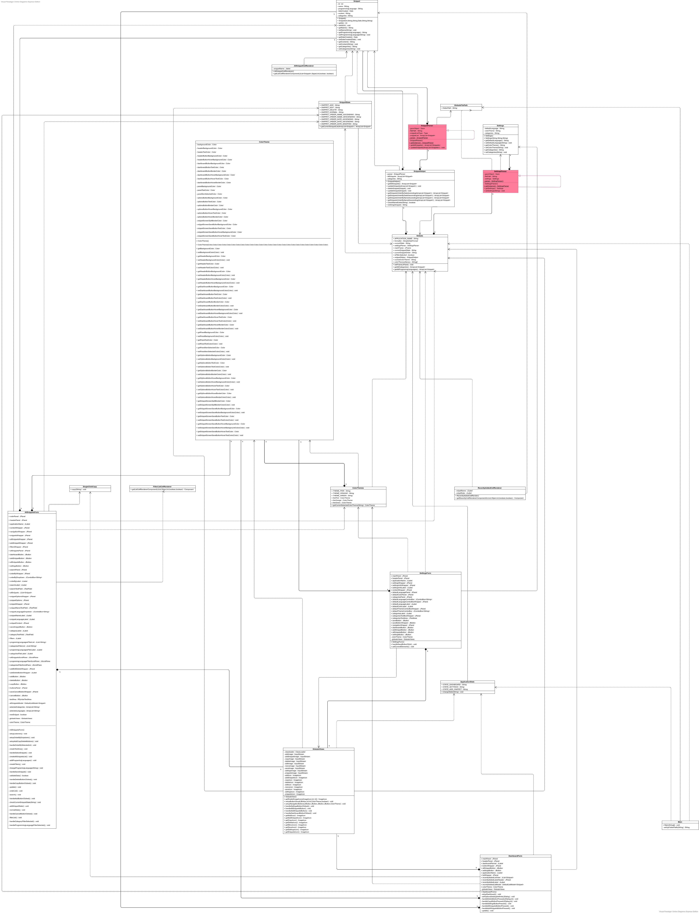

# Assignment 3
<br>Dimitar Georgiev - dgv500
<br>Klimis Tsakiridis - kts480
<br>Iva Dimitrova - ida460
<br>Stoyan Tsinov - stv500


### Summary of changes of Assignment 2
Author(s): `Dimitar Georgiev, Iva Dimtirova, Stoyan Tsinov, Klimis Tsakiridis`

A number of changes were made in the code and documentation of our Code Snippet Manager:
- The Global class was changed. A clear distinction was made between the attributes and the operations. Additionally, some error handling was added
- The code classes were separated accordingly, resulting in a more organized code
- The multiplicity was added in the Class Diagram
- The UML constructs in the class diagram were fixed and are now suitable for a class diagram
- STATE_ALL_SNIPPETS was added to the class diagram
- Private operations were signed accordingly in the class diagram (-)
- The missing relationships in the object diagram were added
- The "Main" structure in the object diagram was fixed and now is a rectangular structure
- Multiplicity was added in the object diagram
- All objects in the object diagram are now linked and there are no isolated islands
- Transitions were added in the state diagram, and additionally, they were described in the documentation.
- Updated Class Diagram with appropriate private/public methods and/or variables

You can see that the changes are made and are reflected in our code and Class Diagram. 

Since Assigment 2 we have refactored quite a lot of classes in our code: 
- The `Color` class now has changed and it is used now.
- We use `resource` folder to read all of the media files
- Using external files to keep the data
- Using parameters from the terminal in order to point to a custom created folder to keep the files created
- Accessing the `home.directory` of teh current logged in user in order to keep the needed files there if no folder path was specified

### Application of design patterns
Author(s): `Dimitar Georgiev, Iva Dimtirova, Stoyan Tsinov, Klimis Tsakiridis`

`Figure representing the UML diagram`\


| ID  | DP1  |
|---|---|
| **Design pattern**  | Singleton |
| **Problem**  | `SnippetParser` class cannot be instantiated twice. If we can do that we run the rick of having two snippets list at the same time that are not synchronized, which means that any manipulation we do on a snippet list may behave unexpectedly.  |
| **Solution**  | Implementing a singleton version of `SnippetParser` class will restrict it to be initialized only once. That will solve our problem since we have only one list in the `SnippetParser` |
| **Intended use**  | The class will be instantiated in `Globals` where will be the entry point of the parser |
| **Constraints**  | There are no constrains |
| **Additional remarks**  |  |

| ID  | DP1  |
|---|---|
| **Design pattern**  | Singleton |
| **Problem**  | `SettingsParser` class cannot be instantiated twice. If indeed we have two parsers reading and writing to file can be tricky and can lead to "deadlocks" or lead to functionality malfunction. Settings are important for our application since this is the place where the user can set its color theme, add categories adn set default programing language. We dont want to trouble the user experience.  |
| **Solution**  | Implementing a singleton version of `SettingsParser` class will restrict it to be initialized only once. That will solve our problem since we have only one list in the `SettingsParser` since we will read/write to the file only once we will escape all kind of deadlocks or other problems already mentioned. |
| **Intended use**  | The class will be instantiated in `Globals` where will be the entry point of the parser |
| **Constraints**  | There are no constrains |
| **Additional remarks**  |  |

We are aware that this is only one design pattern appearing twice, but because of the fact that we were too far with the code during Assignment 2 we were facing the challenge to refactor basically the whole logic of teh project. We reviewed our code and found some appropriate places to integrate two more design patterns: `Decorator Pattern` and `Observer Pattern`. Here is the way we should of approach it since the beginning.

Where we should of use the `Decorator Pattern`:\
If you see our code you will notice we have three different types of buttons: Dashboard, Options, Dialog.\
Possible improvement of teh code will be to integrate the `Decorator Pattern`. Creating an <<abstract>> class `ButtonDecorator` that will be the basic button. And create three different button classes and reduce the code we have now by quote a lot. The only problem that we will face using this approach is that if we add the buttons from the UXBuilder provided in any IDE with UX support they will have an (x,y) point of the screen which we will loose if we re-assign the same object using teh decorator classes. \

Where we should of use the `Observer Pattern`:\
If you see our code you will notice that in  every `AllSnippetsForm`, `DashboardForm`, `SettingsForm` we use an `update()` method which will update the `DefaultListModel` or we are setting a new `DefaultListModel` model to the `JList`.\
Using the `Observer Pattern` can improve the code and will make sure that all of this list updates will happen dynamically. This means that we do not need to worry about forgetting to update teh UI so the user can see the newly created, edited, deleted snippets. Furthermore, we can also include the filtering since the `JList` is affected there as well. Which means that in the `update()` method we need to update the `DefaultListModel` the same way we are doing it now. After some research we did online, we saw that the `DefaultListModel` is supposed to work as an `Observer` which means that at the moment we change the `List` the model should pick up and update the views in the `JList`.

Not implementing the mentioned scenarios is a huge miss, but the refactoring we had to do was too big of a change and we did not want to risk it. But this can be seen as an improvement room for our code.

## Class diagram									
Author(s): `Dimitar Georgiev, Iva Dimtirova, Stoyan Tsinov, Klimis Tsakiridis`

This chapter contains the specification of the UML class diagram of your system, together with a textual description of all its elements.

`Figure representing the UML class diagram`\


#### Main.java

```Java
...

public class Main {

    public static void main (String[] args) throws IOException {

        if(args.length > 1  && (args[0].equals("-p") || args[0].equals("--path"))){

            GlobalsFilesPath.folderPath = setUpFolderPath(args[1]);
            Globals.currentState = ApplicationState.STATE_DASHBOARD;
            Globals.setFrame(new DashboardForm().mainPanel);

        } else {

            GlobalsFilesPath.folderPath = setUpFolderPath(System.getProperty("user.home"));
            Globals.currentState = ApplicationState.STATE_DASHBOARD;
            Globals.setFrame(new DashboardForm().mainPanel);
        }

    }

    private static String setUpFolderPath(String rawPath){

        if(!rawPath.substring(rawPath.length() - 1).equals("/")){
            rawPath += "/";
        }

        return rawPath;
    }
}

...
```
Since Assigment 2 we have refactored the our Main class in order to handle arguments passed from the terminal. In order to customise the argument passing we are also expecting the user to include `-p` or `--path` followed by the full path of the document. After this arguments area read from the terminal we set check if the user actually sent the path. If that is the case we set a global variable containing the folder where the JSON files will be created. After we set the folder path we navigate and show the initial screen of our application, which is the Dashboard screen. In order to have clear separation between the different state of the application we set the current state of it to state `DASHBOARD`. This application state will determine which screen to be shown. If an argument is missing than the `HOME_FOLDER` of the user will be selected and the files will be created there. The rest of the flow is exactly the same where the folder path was passed as an argument.
The `Color` class now has changed and it is used now.
#### ColorTheme.java

This class is used to access the colors used trough the application. When the application is started an instance from this class is created dependent on the which was the last settings set in the settings.json. This instance is available per form since we need to see the colors for all components and we cannot be sure at what time the user will request a different component. The `colorTheme` is not located in the `Globals` since the color the,es can be changed dynamically by the user. The class has an empty constructor that will take the default/last set color theme. When the user changes the settings for the color theme the new color theme will be dynamically injected in the instance and change the whole look and feel. We are aware that there are plenty of data fields present in this class but we wanted to make sure that when using a color we use the correct color instead of wondering which color goes where, hence we have fields such as: `snippetScreenSaveButtonHoverBackgroundColor`, `dashboardButtonHoverBackgroundColor` which will explicitly say for which element we use the given color. 

#### Settings.java 
This class will hold/create the settings. The various settings will be held in this class. The class contains information about the settings for the system such as: defaultProgramingLanguage, categories and colorTheme. The class is instantiated only once in the `Globlas.java` class from where the settings are read in the system. Settings can be set/get using the UI SettingsForm. In this way we are flexible with color theme, categories and default programming language.


#### SingleClickCopy.java

The class contains s single method `copy(Snippet snippet)` that will copy the content of the snippet passed as a parameter. The content of the snippet will be set in the “copy buffer” of the system. So basically this copy method will perform `ctrl + c` for us so the user can paste it anywhere he/she wants.

#### Snippet.java (introduced v1.0 still alive) 

The snippet class is the class that is used to create snippets. All if its variables are private. The snippet class is used when we parse the snippets.json file. The parser will create an ArrayList of snippets that we will use through the system. The data fields of this class are:
```
name
programingLanguage
dateCreated
content
categories
dateModified
```

All of its data fields are private. In order to get/set any property of a snippet, we use the provided getters and setters. Up until this point, we think that this information about the snippets is enough. If by any chance we need an extra field, we can easily add it and use it trough the system.

#### SnippetHelper.java

The Snippet helper class is the class that manipulates the snippets. It instantiates the `SnippetParser.java` class which provides the data and is using this data according to our needs. We are using only one object from type `ArrayList<Snippet>` containing all snippets and we used it to complete the needed manipulations. Here are the methods used in this class:

`public SnippetHelper()`\
A constructor without any arguments that creates an instance of the SnippetParser class and reads all of the snippets from it.

`public ArrayList<Snippet> getAllSnippets()`\
Returns a list with all of the snippets fetched form the parser. 

`public void updateSnippets(ArrayList<Snippet> updatedSnipptes)`\
This method will take the updatedSnippets list and parse it back to JSON format using the SnippetParser class. Depending on the list we pass this information will be stored in the snippets.json file.

`public void deleteSnippet(Snippet snippetToBeRemoved)`\
Deletes a certain snippet from the list and updating the snippet.json file

`public void editSnippet(Snippet snippetToBeEdited)`\
Updates a snippet with the newly entered information.

`public ArrayList<Snippet> getSnippetsOrderByDateAscending()`\
Returns a list with ordered snippets by dateCreated ascending order.

`public ArrayList<Snippet> getSnippetsOrderByDateDescending()`\
Returns a list with ordered snippets by dateCreated desscending order.

`public ArrayList<Snippet> getSnippetsOrderByName()`\
Retruns a list with ordered snippets by name.

`public String toString(Snippet snippet)`\
Custom to string method, mainly for testing purposes to see if the data is passed correctly.

The filtering is moved from this class to `AllSnippets.java` since we a lot of components we need are part of the UI.

#### ApplicationState.java
The sate class is controlling what the current view will be. We have four main states:
```java
public static final String STATE_DASHBOARD      = "STATE_DASHBOARD";
public static final String STATE_SETTINGS       = "STATE_SETTINGS";
public static final String STATE_ADD_SNIPPET    = "STATE_ADD_SNIPPET";
public static final String STATE_ALL_SNIPPETS    = "STATE_ALL_SNIPPETS";
```

These static variables will determine the state of the application and populate the screen accordingly.

`public void changeState(String newState)`\
This method will be used every time we change the state (switch a screen). This method will set the current state depending on what we pass as a parameter and will show the appropriate screen depending on this parameter. For example:
The user is on the AllSnippets screen, the current state is  `STATE_ALL_SNIPPETS`, that means that on the screen now we will see all snippets. The user clicks the navigation and he/she goes to Dashboard. When this click occurs we will trigger an event that will change the state to  `STATE_DASHBOARD` and call this method with parameter `STATE_DASHBOARD` which will change the screen to Dashboard.

Doing so we can easily control the screens and changing a screen will not be so difficult.

#### SnippetParser.java (introduced v1.0 still alive) 
The snippet parser is the class that will read the snippets.json file and turn the JSON string into Snippet objects and vice versa. Using the `folderPath` we set from teh Main class, we are looking for a `snippets.json` file, if such file is found we pars it and we create the snippets list. If in case there is no file we create a file called `snippets.json` including a single snippet with basic content. When we parse the `snippets.json` file an object is created from this type. When the user changes/added a snippet in the application the current snippet list will be updated and translated back to `JSON` and saved as such. The class contains a constructor and two methods:
```java

public SnippetsParser() {
    this.gsonObject = new GsonBuilder().setDateFormat("dd/MM/yyyy").create();
    this.filePath = GlobalsFilesPath.folderPath + "snippets.json";
    this.snippetListType = new TypeToken<ArrayList<Snippet>>(){}.getType();
    this.snippetList = new ArrayList<>();
}

```
Here we set the date format we use for the snippets, the path to the `snippets.json` file, the type we will use when we read the `Snippet` objects to `JSON` and we initialize the snippetsList.

`public ArrayList<Snippet> getAllSnippets()`\
In this method, we read the JSON file and we create a list with `Snippets` objects from it. This is the only instance of this list that we use all the time. Doing so we make sure that we read the file only once since there is a possibility that this file becomes too big.

`public void updateSnippets(ArrayList<Snippet> updatedSnippets)`\
This method updates/overrides the current file we have depending on the list that we pass. We use the `Type` created in the constructor to point out to the `Gson` library that we want to deserialize the object in a certain format. The method is called every time the user changes/adds/deletes a snippet to reduce the data loss in case of a crash.

#### SettingsParser.java (introduced v1.1 still alive) 
The settings parser have the same functionality as the snippet parser but it is parsing the `settings.json` file. Using the `folderPath` we set from teh Main class, we are looking for a `settings.json` file, if such file is found we pars it and we create the settings. If in case there is no file we create a file called `settings.json` with the default settings in place. When we parse the `settings.json` file an object is created from this type. When the user changes a setting in the application the current settings object is updated and translated back to `JSON` and saved as such.


#### ColorThemes.java
The class creates a `ColorTheme` depending on the selected color theme from the `SettignsForm`.

```Java
public static final String THEME_PINK = "THE_PINK";
public static final String THEME_ORANGE = "THE_ORANGE";
public static final String THEME_GREEN = "THE_GREEN";
```

This static variables are used to distinguish between the different color themes. 

```Java
ColorTheme thePink;
ColorTheme theOrange;
ColorTheme theGreen;
```
This are the available color themes that are predefined for teh user. Using the `public static ColorTheme getCurrentSelectedColorTheme()` we are changing the current color theme that will apply to all of the forms using UI elements.

#### Globals.java (introduced v1.0 still alive) 
A class consisting only from static methods and variable. This class is crucial for the application. Since in lots of places we use the same code this class will hold this code for us so we can reuse it at anytime. 
```java
public static final String APPLICATION_NAME = "Coniunx";
public static SimpleDateFormat formatter = new SimpleDateFormat("dd/MM/yyyy");
public static String currentState = "";
public static SettingsParser settingsParser = new SettingsParser();
public static JFrame mainFrame = new JFrame(Globals.APPLICATION_NAME);
public static String currentSnippetState = SnippetState.SNIPPET_NORMAL;
public static String currentSnippetOrder = SnippetState.SNIPPET_ORDER_NAME_ASCENDING;
public static boolean isFilterSelected = false;
public static SnippetHelper snippetHelper;
public static String currentColorTheme;
```

Static variables help us getting the currentState of the application as well as the name of the application. Here we also have an instance of the snippetHelper that will provide the snippet manipulations as well as the `settingParser` that will provide the settings. During the usage of the application, these variables will change and we do not need to worry about is since they are static and every time we need them, we will get their current situation.\ 
`APPLICATION_NAME` will provide the applciaiton name\
`formatter` will provide the date format for the entire application\
`currentState` will provide current state for the application eg: DASHBOARD, ADD_SNIPPETS, SETTINGS\
`settingsParser` will provide the settings for the application\
`mainFrame` is the main frame for the application\
`currentSnippetState` will provide current snippet state which will tell teh application if the we are adding/editing/deleting a snippet\
`currentSnippetOrder` will provide current snippet order type\
`isFilterSelected` will tell us if there are any selected filters, both programming languages and/or categories\
`snippetHelper` will provide snippets and methods that manipulate this snippets for the application\
`currentColorTheme` will provide current color theme for the application\

`public static void setFrame(JPanel panel)`\
Used to set the frame depending on the current state of the application.

`public static ArrayList<String> getAllCategories()`\
We use it in a couple of places. This reduces the code length.

`public static ArrayList<String> getAllProgramingLanguages()`\
Used to get all of the supported programing language.

`public static String[] colorThemesNames = {"Light","Dark","Moonlight"};`\
Used to populate the drop-down list in the Settings screen. Depending on the choice we will change the theme accordingly.

When we notice a repetitive code we put it here as a static variable/function for ease of use and access. More methods and/or variables can be moved here.

#### GlobalsViews.java (introduced v1.1 still alive) 
All the button styling that we used will be created here. Setting colors, icons, and text. This class will hold all the repetitive code for the visual parts of the application. Currently, most of the methods are in the From classes themselves but we will refactor it and make sure that the repetitive methods will be here. 

The only case where we have to set the listeners of the button we consider to keep it in the Form classes itself since this will give us more flexibility to make the button perform not general.\
```java
private ClassLoader classloader;
    
private InputStream addImage;
private InputStream addSnippetImage;
private InputStream copyImage;
private InputStream deleteImage;
private InputStream editImage;
private InputStream menuImage;
private InputStream saveImage;
private InputStream settingsImage;
private InputStream snippetsImage;

private ImageIcon addIcon;
private ImageIcon addSnippetIcon;
private ImageIcon copyIcon;
private ImageIcon deleteIcon;
private ImageIcon editIcon;
private ImageIcon menuIcon;
private ImageIcon saveIcon;
private ImageIcon settingsIcon;
private ImageIcon snippetsIcon;
```
All of this variables will create the icons that will be used in order to create the buttons. We have `InputStream` which later is converted to `ImageIcon` since this is the only format accepted by the `JButton`.

`public ImageIcon getScaledImageIcons(ImageIcon imageIcon, int width, int height)` - in order to keep the quality high we need to resize a big image to smaller and using smooth filter from Java libraries to smoothen it. This function is doing this for us.\
`public void setupButtonVisual(JButton optionButton, int width, int height, ColorTheme colorTheme, boolean dashboardButton)` - setting the button visuals as color, image, size, border etc.\
`public void setupNavigationButtons(JButton allSnippetsButton, JButton addSnippetButton, JButton settingsButton, JButton dashboardButton, ColorTheme colorTheme)` - creating the navigation menu used during the different states\
`public void handleSettingsButtonClicked()` - handles settings button clicked from the navigation\
`public void handleAllSnippetsButton()` - handles all snippets button clicked from the navigation\
`public void handleAddSnippetsButton()` - handles add snippets button clicked from the navigation\
`public void handleDashboardButtonClicked()` - handles dashboard button clicked from the navigation\

The class also contains ONLY getters for every `ImageIcon` since we dont want anyone to change them\

#### AllSnippetCellRenderer.java
The class constructs a single list view that will be populated in the list. Especially this case  the class is setting the list to contain the name of the snippet plus the extension of the file, which basically will be the filename.

`private JLabel snippetName` - will provide the text containing the snippet name\
`public Component getListCellRendererComponent(JList<? extends Snippet> jList, Snippet snippet, int index, boolean isSelected, boolean cellHasFocus)` - will give the `Component` that will contain a single list item

#### FilterListCellRenderer.java 
The class constructs a single list view that will be populated in the list. Especially this case the class is making a list of checkboxes with the categories or programing language filter. The class is used in both cases. Setting some click listeners will allow us to select multiple items and read back which items are selected. Using these items as parameters in the SnippetHelper class we can filter the snippet list.

`public Component getListCellRendererComponent(JList list, Object value, int index, boolean isSelected, boolean cellHasFocus)` - will give the `Component` that will contain a single list item

#### RecentlyAddedCellRenderer.java 
The class constructs a single list view that will be populated in the list. Especially this case the class is setting the item to have two text fields, one with the name and the second with the date created. Setting a double click listener to the item we get the option to edit/delete/copy the selected snippet.

`private JLabel snippetName` - will provide the text containing the snippet name
`private JLabel snippetDate` - will provide the date created of the snippet name\

`public Component getListCellRendererComponent(JList<? extends Snippet> jList, Snippet snippet, int index, boolean isSelected, boolean cellHasFocus)` - will give the `Component` that will contain a single list item

\
\

The whole application UI will be created using Swing Forms. We will have one main Swing Frame that can be repainted with different Forms. Every application state will have its own form. The following classes will explain how the components in these Forms will be handled in the different states.

#### AllSnippetsForm.java
This class will paint the all snippets screen. We will have a text area that will handle the content insertion/edition, a filter panel that will contain all the filters and snippets list that will contain the current existing snippets. Furthermore, we will have a dedicated button to add a snippet that basically will empty the text area and provide the possibility to the user to insert new information about the snippet. All of the different parts mentioned will be placed in wrapper panels for ease of placement on the screen. Navigation will be provided on the left-hand side for ease of access to all of the other screens. Using the Globals.java we can access all of the needed information with a combination of the SnippetHelper we can manipulate the snippets. A search box is present here which has an onKeyUp listener that will change the data model dynamically in order to see the results immediately in the snippets list located on the same screen. The filters will have the same functionality using again the SnippetHelper class.

`private void createTextArea()`\
Creates a text-area that has a syntax highlighter.

`private void handleSelectSnippet()`\
Updates the visual content part with the selected snippet data.

`private void createAllSnippetsList()`\
Populates the snippets list with the correct list render.

`private void addProgramingLanguages()`\
Populate the programing languages drop-down menu

`public void createFilters()`\
Creates the filters checkboxes

`private void changeProgramingLanguage(String programingLanguage)`\
When a user chooses a snippet from the menu we are changing the selected programing language accordingly.

`private void handleSaveSnippet()`\
If it is a new snippet, we add the new snippet. If it is existing, we update it.

`private void validateData()`\
Validate the data: if the name is empty or already exists, or if the content is empty, give a warning message.

`private void update()`\
This method will update the snippets list view

`private void search()`\
The search method will change the data model of the snippets list

`private void setupListeners()`\
This method will set up all of the listeners for the buttons used on this screen

`private void setupOrderByDropdown()`
Add order by filters dropdown menu

`private void setupAddCopyDeleteButtons()`\
Setting up the visuals for teh add, delete and copy

`private void handleOrderBySelected(int selectedOrderType)`\
Used to get the selected index of teh order by dropdown and set the `Globals.currentSnippetOrder` appropriately. Also calling the `orderList()` function which will order the current list of snippets presented to the user.

`private void handleDeleteButtonClicked()`\
Delete the selected snippet. Is no snippet is selected display a message.

`private void handleCopyButtonClicked()`\
Copy the selected snippet. Is no snippet is selected display a message.

`private void orderList()`\
Orders the list from the current `Model`

`private void handleAddButtonClicked()`\
Adds a snippet to teh current `Model` if teh snippet is validated trough `validate()`, if not an appropriate message will be displayed.

`private void checkCurrentSnippetState(String snippetState)`\
Checking teh current snippet state and call the appropriate method to set up teh visuals.

`public void addSnippetState()`\
Changes current visual on the page to suit adding snippet purposes.

`public void normalState()`\
Reverts all of the changes made in `addSnippetState()`.

`private void handleCancelButtonClicked()`\
Changes current visual on the page when cancel button is pressed.

`private void filterList()`\
Filtering the list accordingly to teh filters the user selected. Eg:\
- Select from categories: "Category 1" - the list will display only snippets containing "Category 1"
- Select from from programing languages: "Java" - the list will only snippets containing "Category 1" and are written in "Java"

`private void handleCategoryFilterSelected()`\
Handle category filer selected

`private void handleProgrammingLanguageFilterSelected()`\
Handle programming language filer selected

#### DashboardForm.java
This class will paint the all dashboard screen. This will be the initial state of the application. In this screen, we will have a list of the recently added snippets that will instantiate the AllSnippetsListRenderer in order to populate the list. Moreover, we will have the options to Add Snippet, see All Snippets and change Settings. These options will be provided with separate buttons in order to be able to change the state of the application so we can repaint the other screens. 

`public void setupDashboard()`\
Setting the visuals of the buttons and other elements.

`private void setOptionsDialogSettings(JDialog optionsDialog)`\
Creating the dialog box with the options per item such as edit/delete/copy

`private void handleDeleteButtonPressed(JDialog optionsDialog, int index)`\
Called when delete button is clicked. It will delete the selected snippet.

`private void handleCopyButtonPressed(JDialog optionsDialog, int index)`\
Called copy the button is clicked. It will copy the content of the snippet.

`private void handleSettingsButtonClicked()`\
Called when the settings button is clicked. It will go to the settings screen and it will set the `Globals.currentState = ApplicationState.STATE_SETTINGS;`.

`private void handleAllSnippetsButton() `\
Called when the all snippets button is clicked. It will go to the all snippets screen and it will set the `Globals.currentState = ApplicationState.STATE_ADD_SNIPPET;` and the snippet state to `Globals.currentSnippetState = SnippetState.SNIPPET_NORMAL;` since depending on the snippet state some visuals will change.

`private void handleAddSnippetsButton()`
Called when the add snippets button is clicked. It will go to the add snippets screen and it will set the `Globals.currentState = ApplicationState.STATE_ADD_SNIPPET;` and the snippet state to `Globals.currentSnippetState = SnippetState.STATE_ADD_SNIPPET;` since depending on the snippet state some visuals will change.

`private void update()`\
Used to update the Recently added list when an item is deleted.

#### SttingsForm.java 
This class will paint the settings screen. In this screen, the user can choose the color theme and the default programing language. What is more, he/she can add the categories here as well in a comma-separated list. When pressing the save button the settings will be applied automatically and also will be parsed back to the `settigns.json` file. This will play the role of “saving” your settings for next time or until they change again.

`private void handleSaveButtonClick()`\
Applies and saves the settings in the `setigns.json` file and updates the current. Furthermore, if any changes are made in teh Color Theme or the Categories, all this settings will be available at the moment the user changes the screen

`private void setCurrentElements() `\
Setting the values of the elements of teh screen.


## Object diagrams								
Author(s): `Dimitar Georgiev, Iva Dimtirova, Stoyan Tsinov, Klimis Tsakiridis`

Above you can find our object diagram. 
In some cases such as in the ApplicationState class, we have an instance of a class but we do not keep it in object since we are using only one field/method of it. Eg:\

`Globals.mainFrame.getContentPane().add(new DashboardForm().mainPanel);`\

Here we are just using the `main panel` in order to repaint the current main from the panel. Since the mainPanel is public and we can access it like that we decided that storing it in the memory is a bit of overkill.\

Furthermore, in the following paragraphs we will explain the logic behind why we create and how we use the created objects.\

The main method is using the `ApplicationState` class in order to change the view and show the Dashboard screen. As discussed in Assignment 1 this will be our starting point. The `ApplicationState` class is using the changeState method to display the freshly created Dashboard panel.\

The Dashboard screen contains a JList that will be populated with the `RecentlyAddedCellRenderer`. This object will draw the item per list row. When we double click we will get the option to edit/delete/copy a snippet and change the currentSnippetState in Globals. Both edit and copy functions are part of the `SnippetHelper` class which is instantiated only once in the Globals as static so we can use it any time we need to perform manipulations of the snippets. Since we have the copy to clipboard feature moved to a different class, we also create an object from it in order to use the copy method.\

The class `DashboardForm` contains one class of instance `SnippetState`. The class sets the `currentSnippetState` in `Globals` accordingly in case the “All Snippets” or “Add snippet” button is activated. \

The `Globals` class contains all objects and methods that are used more than once but need to be initialized only once in order to prevent any confusions of the system. It contains objects from type: `SnippetParser`, `SnippetHelper`, `SimpleDateFormat` and `JFrame`. All of the mentioned objects are accessed more than once, thus the access is static.\

The `SnippetHelper` class contains a `SnippetParser` which will provide all of the snippets. The `SnippetParser` is initialized only once in order to make sure that we have only one instance of the snippets list. The helper contains a single instance of an `ArrayList<Snippet>`. This list is used in order to complete the desired snippet manipulations. When manipulation is requested this list will be the base for it, Depending on the manipulation a new updated list will be returned as a result. The new list will be used from the GUI to display the result from the search for example. The only exception is when we add/delete/edit snippets which we will use the object selected from the new list and add/edit/delete from the original list fetched from the parser. Doing so we will synchronize both lists to contain up to date objects as well as keep the `snippets.json` file up to date, since to reduce the chance of data loss we will update the file on every add/edit/delete request.\

The `SettingsForm` contains an instance of the settings that are located in the `Globals`. When the user changes the settings we will use this reference and access the `SettingsParser` in order to update the new settings.\

The `AllSnippetsForm` class contains `DefaultListModel` from type Snippet that will provide the data for the `AllSnippetCellRenderer` to create the all snippets list. The snippets will be taken from the `Globals.snippetHelper.getAllSnippets()` and will be populated in the `JList`. Moreover, The filters used have a custom made cell render as well in order for the items to selectable more than one at the time without refreshing the whole JList. The list is using an instance of `AllSnippetsCallRenderer` to accomplish this. The `currentSnippetOrder` object in Globals is responsible to keep the snippet order which the user has most recently chosen.\

The SnippetParser will use the `Gson` object that is part of the `Gson` library and serialize or deserialize the snippets. The `gsonObject` uses the dateFormat object that will set the date format to the date when the snippet is formatted. Since we are sure the `snippets.json` file will contain a list with snippets we have to make sure that we note that to the `Gson` object in order to be able to parse the data properly. This is done by extracting the class type from the list using the `snippetListType` object.\

The `SettingsParser` has the same logic as the SnippetParser with the difference that we do not use the type object since the settings can be only one. The data is handled with the same `Gson` library.


## State machine diagrams									
Author(s): `Dimitar Georgiev, Iva Dimtirova, Stoyan Tsinov, Klimis Tsakiridis`

This chapter contains the specification of at least 2 UML state machines of your system, together with a textual description of all their elements. Also, remember that classes the describe only data structures (e.g., Coordinate, Position) do not need to have an associated state machine since they can be seen as simple "data containers" without behaviour (they have only stateless objects).

For each state machine you have to provide:
- the name of the class for which you are representing the internal behavior;
- a figure representing the part of state machine;
- a textual description of all its states, transitions, activities, etc. in a narrative manner (you do not need to structure your description into tables in this case). We expect 3-4 lines of text for describing trivial or very simple state machines (e.g., those with one to three states), whereas you will provide longer descriptions (e.g., ~500 words) when describing more complex state machines.

The goal of your state machine diagrams is both descriptive and prescriptive, so put the needed level of detail here, finding the right trade-off between understandability of the models and their precision.

Maximum number of words for this section: 4000

## Sequence diagrams									
Author(s): `Dimitar Georgiev, Iva Dimtirova, Stoyan Tsinov, Klimis Tsakiridis`

Sequence diagrams are all about capturing the order of interactions between parts of your system. Using a sequence diagram, you can describe which interactions will be triggered when a particular use case is executed and in what order those interactions will occur. Sequence diagrams show plenty of other information about an interaction, but their flow is the simple and effective way in which they communicate the order of events within an interaction. They illustrate how the different parts of the system communicate with each other when a certain action should be executed and the order of the sub action that needs to be done in between.
 
In our application, from the main dashboard four types of main
interactions that could be done.\
***First main action:***\
The first main action is Dashboard. It opens the main dashboard of the application from where it is possible to perform all other main actions. It contains the icons leading to the new pages but also a bar containing the last snippets created. At this point, sub-actions are also possible
Sub actions available from the dashboard.
As well as performing main actions, at the dashboard the user is given an option of performing 3 sub actions. On the screen a list of the last edited snippets appears in descending order. By
double clicking on each of them a little menu is shown, presenting three sub actions available to the user to perform:\
***First sub action from the main dashboard: EDIT***\
This sub action leads to a main action by changing the screen,
leading to a page allowing the user to make changes to the chosen snippet. It
plays roles as a shortcut to the edit page.\
***Second sub action from the main dashboard: COPY***\
This sub action takes the content of the snippet and copies it. \
***Third sub action from the main dashboard: DELETE***\
With this sub action the user can remove a snippet from his list.
 
***Second main action:***\
Second one is “Add Snippet”. It opens a new page with the same
interface as the “All Snippets” action with the difference that some of the sub actions that are possible to do are disabled at this page. For example, the user cannot do changes on the already created snippet from the database, also the list of snippets cannot be ordered or filtered in any way. We have the following sub action:  Since we are using JSON format, for the
adding of a snippet we would need some information that the file should
contain. To create the snippet, there are six in total sub actions:\
 ***First sub action: Inserting the name of the snippet.***\
This sub action is one of the necessary ones that the user
should do in order to create a new snippet. A little bar is available for performing the sub action. The name should be unique, if not an error message would appear.\
***Second sub action: Select programming language.***\
There is a given option to choose a programming language. This
one could be done by the system itself after the file is saved so therefore not
a necessary action. Every snippet has a property called “programming language:
String”. If the input from the user is empty, therefore not done filled with
the language of the text that the person wants to save as a snippet, the
program goes through the function
changeProgramingLanguage that would check the syntax of the input and add the name of
the programming language in the properties of the snippet. If the user
wants to add a snippet using a language that is not among the ones that could be
chosen, the code remains as “plain text”, with no highlights.\
***Third sub action: Insert category.***\
Another useful feature that our system provides is performing
the sub action “Category”. Those are some categories added to the system beforehand by the user. This one is not essential for the creation of a
snippet file. By adding category to the file, later on the user could sort
the snippets by the category used for the files.<br>
***Fourth sub action: Add content.***
In the box given for this purpose the user should enter the text
that would be later on saved as the actual snippet that the user wants. If not, an error message would appear on the screen.\
***Fifth sub action: Save snippet.***\
The final sub action is the actual saving of the snippet. After
all the information is gathered from the user, the program first appends the
snippet to the snippet list. Then sends a list containing the properties to a
data parser which parse the given list to JSON format. It goes through a validating function to check if the given information from the user suits the data the system needs in order to save a snippet into the database. Then after that, depending on the return value of the validating function, the snippet would actually be saved. If it does not suit the requirements, the user gets an error message.\
***Sixth sub action: Cancel***\
At any point the user can decide to start over, in that case
next to the “Save” button, a “Cancel” button could be found. This would reset
everything the user has done so far, clearing the name bar, language bar,
category bar and the content bar.

***Third main action:***\
Third one is “Snippets”. This action changes the page to a new
one. From that newly shown interface, there are five sub actions that could be
performed.\
***First sub action “View all snippets”.***\
This property is enabled from the opening of the page – on the
middle left side all the snippets of the user are shown ordered by default in a
date descending order.\
***Second sub action: Order snippets.***\
In order to make the search of a certain snippet easier and more
efficient, another sub action could be performed at this same page – showing
the snippets in some convenient for the user's order. There is a choice of two
properties which would be used as a sorting tool – the name of the snippet or
the date that the snippet has been created on.\
***Third sub action: Search snippets.***\
For convenience, the user can perform another sub action on the
same page that could ease the search of a snippet from the list – searching
through the snippets. This search could be done by entering the name of the snippet.
As the user is typing the name, the bar with the files gets updated, as it gets
smaller the more specific the typing is to the name. The user is sending a
synchronous message to the database waiting for a response containing the
suggestion name (if the user didn’t type the full one yet) which after clicking
on it again sends a synchronous message to the system, this time getting the
full content of the snippet file.\
***Fourth sub action: Edit snippets.***\
After performing the previous actions, or at least those who
lead to choosing a snippet file, on the same interface the user can also make
some changes to the file, for example changing the programming language,
editing the category, modifying the content of the snippet. After all that, a
sub action of this sub action can be done – saving the snippet. It follows the
same functionality as the “Save snippet” action from the first main action.\
***Fifth sub action: Filter snippets.***\
Another additional sub action is filtering the snippets –
therefore displaying snippets according to a given filter. One could be
depending on the preference of a programming language; another could be showing
only snippets from a chosen category.


***Fourth main action:***
The fourth main action is “Settings”.
The fourth action allows the user to make some changes on the
overall look and some behaviour of the program.
First sub action: Set default programming language.
The first sub action is choosing a default language. This would
be helpful if the user needs only snippets from a chosen language.
Second sub action:  Set colour theme.
This sub action can change the colour of the background of the
program’s interface for every page. The user has the possibility to choose a
colour from a range of colors set by us in the database of the application. The
user can pick among pink, green and orange themes.
Third sub action: Add categories.
For this sub action, the program takes as an input the words
that the user writes in the box separated by a comma for this purpose and
creates a new category by taking the phrase or word.
 
***Example sequence diagrams:
 
There are also some actions available from any other main action: from any interface of the application, the user can perform any main action within any page that is currently accessed. A vertical menu with icons referring to the four main actions possible respectively: accessing `Dashboard`, `Add Snippet`, `Snippets` and `Settings`. The icons redirect the user to the wanted page.
 
In order to save a better look at the behavior of an application, it’s good to take a look at some situations that show how the program reacts and how it handles the different situations. In this section, we are using sequence diagrams. We would illustrate 3 particular scenarios.
 
The first one is when the user wants to add a snippet in a language that is not amongst the ones that can be chosen from the set. In this situation, from the initial starting point, the dashboard, by pressing the “Add Snippet” button the program goes through the `ApplicationState` class, redirecting to the `AllSnippets` class. Since we want to access the Add `Snippet` page, and not the one showing the `Snippets` page, in the class `AllSnippets`, the function `addSnippetState` is called. The reason for that is that the interface of the both pages is relatively the same, the difference is that the options of performing the sub actions of maintaining the already saved snippets are disabled. For example, after entering the Add Snippet page, the user cannot view snippets, filter them in any way or search any of them. From then on a few sub actions are available. In order to create a new snippet, the user can add the name for the new snippet in a bar showing at the top of the page, then an option of adding the programming language of which the snippet would be written on from a falling menu. A few options are available – `plain text, Java, C++, Python, C, Scala, HTML, CSS, JSON, JavaScript, SQL and C#`. There is an empty bar where the user adds the content of the snippet. After all that is finished, 2 sub actions could be performed – saving the snippet and cancelling the whole process which leads to clearing all the information that the user had written so far at all the bars. In this case, when the user does not choose a programming language, initially the program is performing the sub action of saving the snippet, the system would detect itself the language of choice, but if the used syntax is not amongst the ones that are given, this features remains at “Text”. The system does not give out an error, it simply saves the snippet but the text lacks the highlights that would appear if the language was to be recognized. 

`Figure representing the Sequence Diagram 1`\

 
The second one is when the user wants to change the color of the interface. The color of choice in this situation is “The Pink''. First the application is at its initial state – the dashboard. From there, after pressing the “Settings”' button, it goes to a new class, performing a main action changing the interface into the page of the settings’ page. In order to go to the settings’ page, the program goes through a class called ApplicationState, redirecting it to the SettingsForm class. From there, the user has the options of doing three sub actions – change the default programming language of the snippet helper, change the color theme of the interface and to add some new categories into the database of the application. From then on the user would choose to change the color. A falling menu shows when the user presses the bar that enables this action. Three new sub actions are available for the user – to change the color to green, orange or pink. In this situation the user chooses the color Pink. Then the program goes through a switch case taking the input of the user and goes to another class – Settings – changing the color of the theme as it returns the value of “pink” to the SettingsForm class. The new color would appear when the user refreshes the page or, as a whole, perform a main action from the menu that enables the user to change the interface at any point. 

`Figure representing the Sequence Diagram 2`\

 
 
The third one is when the user wants to search for a snippet with a non-existent name. We start from the Dashboard class. The user presses the button for entering the All Snippets main action. Before changing the interface of the page to the one of the one we want to enter, the system goes through the `ApplicationState` class which then goes to the `AllSnippets` class. In that state, the system call the function `AllSnipetsForm`, in order for the user to access the list of snippets and presents the options of doing some sub actions like filtering the list of snippets by their date of creation – ascending and descending, sorting the list by the language that they are written on and allowing choosing more than 1 language, sorting the languages by their name as well. In this case, we will be looking at the sub action looking for a snippet by the name that the snippet was saved with. The system takes the input of the user and goes into a loop checking the already existing snippets and as the loop goes, the bar showing the snippets is getting smaller as the bar with the name gets more specific. Since the user is trying to find a snippet with a name that does not exist in the system beforehand, the bar with the supposed result becomes empty. 

`Figure representing the Sequence Diagram 3`\


## Implementation									
Author(s): `Dimitar Georgiev, Iva Dimtirova, Stoyan Tsinov, Klimis Tsakiridis`

After we finished all of the UML designs we reproduced teh same classes and objects in the system. After some rethinking we decided to split the classes in different `Packages` which will make the code more logical and more readable. Here you can find the structure for our `Packages`:

./main\
|----	./resources\
|----	|----	./textAreaThemes\
|----	|----	|----   dark.xml\
|----	|----	|----   default.xml\
|----	|----	|----   eclipse.xml\
|----	|----	|----   idea.xml\
|----	|----	|----   theme.dtd\
|----	|----	|----   vs.xml\
|----	|----	|add_button.png\
|----	|----	|add_snippet_icon.png\
|----	|----	|copy_icon.png\
|----	|----	|delete_icon.png\
|----	|----	|edit_icon.png\
|----	|----	|menu_icon.png\
|----	|----	|save_icon.png\
|----	|----	|settings_icon.png\
|----	|----	|snippets_icon.png\
|----	./java\
|----	|----	./classes\
|----	|----	|----	ColorTheme.java\
|----	|----	|----	Settings.java\
|----	|----	|----	SingleClickCopy.java\
|----	|----	|----	Snippet.java\
|----	|----	|----	SnippetHelper.java\
|----	|----	|----	ApplicationState.java\
|----	|----	|----	SnippetState.java\
|----	|----	./dataParsing\
|----	|----	|----	SettingsParser.java\
|----	|----	|----	SnippetsParser.java\
|----	|----	./globals\
|----	|----	|----	Colors.java\
|----	|----	|----	Globals.java \
|----	|----	|----	GlobalsViews.java\
|----	|----	|----	ColorThemes.java\
|----	|----	./views\
|----	|----	|----	./listCellRenderers\
|----	|----	|----	|----	AllSnippetsCellRenderer.java\
|----	|----	|----	|----	FilterListCellRenderer.java\
|----	|----	|----	|----	RecentlyAddedCellRenderer.java\
|----	|----	|----	./AllSnippetsForm\
|----	|----	|----	|----	AllSnippetsForm.java\
|----	|----	|----	|----	AllSnippetsForm.form\
|----	|----	|----	./DashboardForm\
|----	|----	|----	|----	DashboardForm.java\
|----	|----	|----	|----	DashboardForm.form\
|----	|----	|----	./SettingsForm\
|----	|----	|----	|----	SettingsForm.java\
|----	|----	|----	|----	SettingsForm.form\
|----	Main.java

##### Main features

***Text Highlighter:***\
We are using the `RSyntaxTextArea` which provides us with a lot of nice options: default language, color theme, syntax highlight, etc. If we have enough time we can also include the autocomplete feature. This feature is an extension that is provided by a different library that extends the `RSyntaxTextArea`.

***JSON Parsing:***\
Instead of DataBase, we decided to use JSON files to keep our data. Using the library Gson. We are using an instance from this library to read the `JSON` files and to parse the existing objects in the system back to `JSON`, The library gives us the flexibility to set any type of list object we desire and will translate the items accordingly. In combination with the local file reader/writer, we are able to read/write the files that will hold the data for the snippets/settings.

***GUI Implementation***\
For the GUI implementation, we decided to go with `SWING`. \
Since we will have three main views we split the GUI into three forms. Every form contains the needed components mentioned in the class-diagram. All of the GUI classes have an instance to the `GlobalsView`. This "connection" will provide the Views to create, style, etc. and also use its functions. Every View class has a `JPanel` called `mainPanel`. This panel is used every time the user is changing the screen. The `State` is calling this `mainPanel` and replacing the current `mainPanel` with the requested one. Moreover, the `currentState` in the `Globals` class will be the variable telling us where the application is at the moment.

***State, Globals, GlobalsViews***\
After some discussion, we decided to create these classes as our "helpers". The classes are crucial for our application. \
`State` class is changing the state and screen of the application. (The class is explained in GUI Implementation part)

The `Globals` and `GlobalsView` are the classed that provide and control the data for the whole system. In `Globals` we can get and use the data from the `settings.json` and `snippets.json` files. Using these classes we will gain access to a single instance if the `settingsParser` and `snippetParser`. Furthermore, the `Globals` also contains a `SnippetHelper` that will complete the snippet manipulation requests. 

***Using Design Patterns***\
Using design patterns helped us improve our code and make it more robust. As explained in the "Design Pattern" we were worried that by accident we can have more than one object which was going to cause errors. Using the singleton was the best solution for our problem. More over, since we could not include the other two design patterns our code end up to not be so pretty but functional.

***
The main fail of the application is located in:\
/src/main/java/Main.java


The JAR file is located in:\
out/artifacts/project_jar/project.jar

**Here are the instructions on how to start our application:**\
1. Create a folder in convenient place for you or use an existing one
2. Copy the full path to the folder in step 1
3. Open Terminal/PowerShell
4. Navigate to the folder where you have download the `project.jar` file (can be the same folder as the one in step 1)
5. Run the following command:\
`java -cp project.jar Main --path "<FULL FOLDER PATH>"`\
or\
`java -cp project.jar Main -p "<FULL FOLDER PATH>"`<br><br>
` <FULL FOLDER PATH>` is the place where you need to paste the full path you copied in step 2.


## References

References, if needed.
